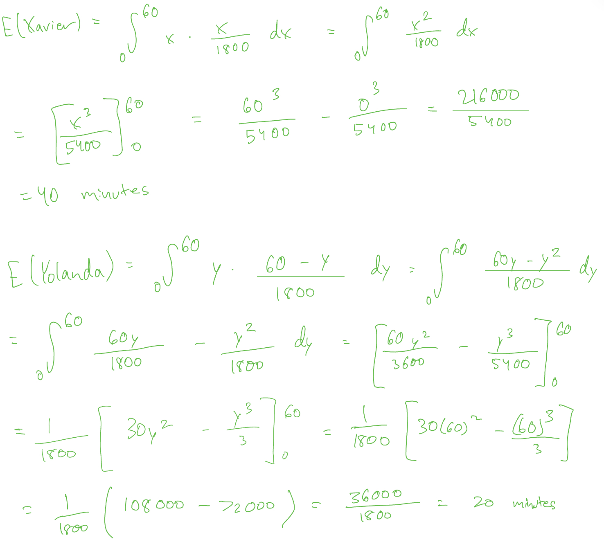
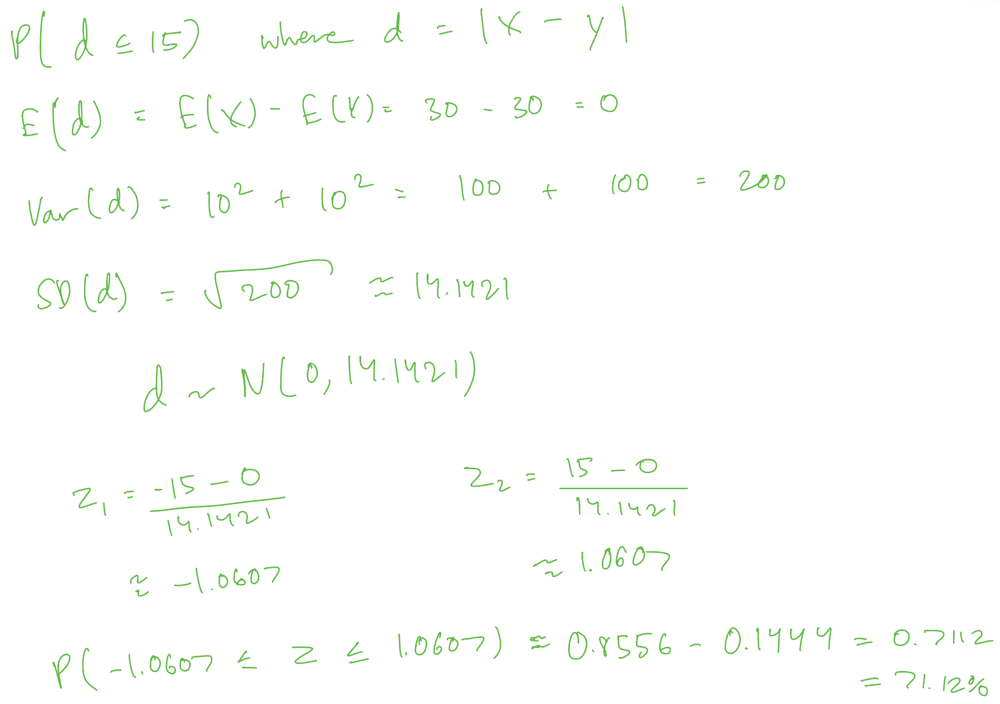
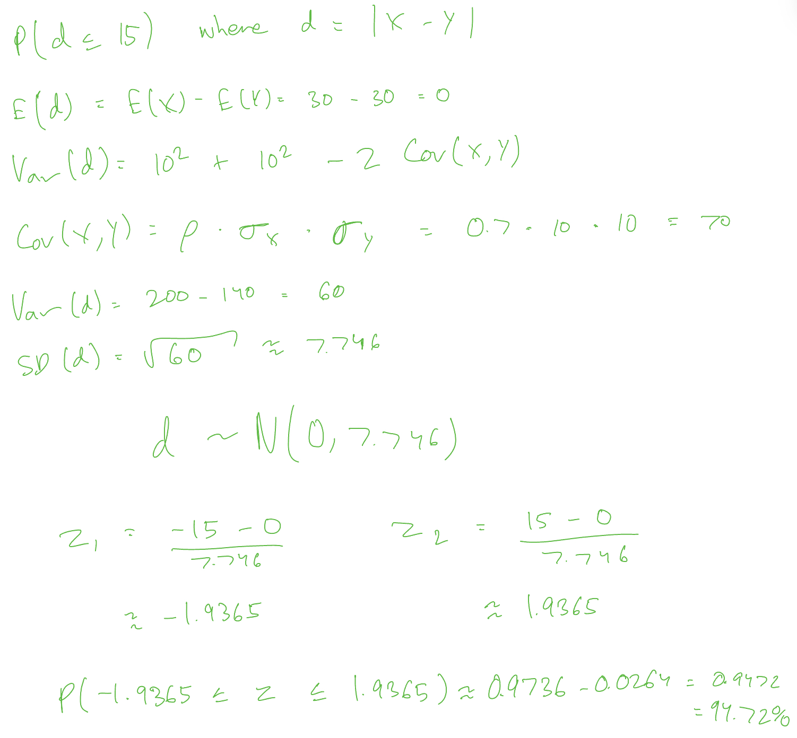

```{r Setup}
#| include: false
options(scipen=999)  # turns off scientific notation
set.seed(1873264)  # set your own seed!
```

This investigation is a little different, in that you'll perform some simulations and then validate your simulation results with mathematical probability.

NOTE: Your code should include no looping and no `replicate()` statements whatsoever. Everything must be vectorized.

------------------------------------------------------------------------

Xavier and Yolanda are supposed to meet at 12:30pm. Their actual arrival times, $X$ and $Y$, are random variables, each measured as minutes after 12pm. (So, for example, Xavier is right on time if $X=30$.) Each of them will wait at most 15 minutes for the other, so they meet if and only if their arrival times are at most 15 minutes apart.

In this investigation, I will present several possible probability distributions for $(X,Y)$, and you will use both simulation and mathematics to analyze each scenario.

------------------------------------------------------------------------

### Before we get to the scenarios, write two building-block functions.

#### 1. Write a function that generates a scatterplot of $(X,Y)$ pairs, *color-coded* to distinguish points where $X$ and $Y$ are at most 15 apart vs. more than 15 apart.

Your inputs will be the simulated pairs of $X$ and $Y$ values that you create later, passed in as two vectors, and the output will be the color-coded graph. You'll have to research how to color-code a scatterplot in R.

Your graph must include a **legend** explaining the color-coding.

Because the output of your function is a plot, your function will not have a `return()` statement.

The axis labels and legend will be the same for every plot you make, so you may hard-code those into your function. However, **the title of each plot must be different** to indicate the different scenarios. So, you'll need to research how to pass arguments through *your* function to the plotting function inside of it.

As always, you're welcome to use base R or fancier packages like `ggplot2` if you're familiar with the latter.

```{r Scatterplot maker}
plot_meeting <- function(x, y, plot_title) 
{
meeting <- abs(x-y) <= 15 
colors <- ifelse(meeting, "blue", "red") 
plot(x, y, main = plot_title,
xlab = "Xavier arrival time", 
ylab = "Yolanda arrival time",
col = colors, 
pch = 16) 
legend("topright", 
legend = c("Meet", "Do Not Meet"), 
col = c("blue", "red"), 
pch = 16) 
}
```

#### 2. Write a function that calculates a 95% confidence interval for the probability that Xavier and Yolanda meet.

Your inputs will be the simulated pairs of $X$ and $Y$ values that you create later, passed in as two vectors, and your output will be a 95% CI for P(Xavier and Yolanda meet).

Your function must call `prop.test()`. Round your endpoints to four decimal places.

```{r CI for Prob of Meeting}
meeting_ci <- function(x, y) { 
meeting <- abs(x-y) <= 15 
result <- prop.test(sum(meeting), length(meeting), conf.level = 0.95)
round(result$conf.int, 4) }
```

------------------------------------------------------------------------

### Scenario 1: Xavier and Yolanda arrive independently and uniformly between 12pm and 1pm, so $X \sim \hbox{Unif}[0,60]$ and $Y \sim \hbox{Unif}[0,60]$.

#### 3. Simulate at least 10,000 $(X,Y)$ pairs. Then create a well-labeled, color-coded scatterplot.

Use your earlier function to generate the plot. No interpretation required.

```{r Scenario 1 scatterplot}
#| fig-height: 6
#| fig-width: 6
x <- runif(10000, 0, 60) 
y <- runif(10000, 0, 60) 
plot_meeting(x, y, "Scenario 1 Scatterplot") 
```

#### 4. Calculate a 95% confidence interval for the probability that Xavier and Yolanda meet.

Use your earlier function for the calculation. No interpretation required.

```{r Scenario 1 CI}
meeting_ci(x, y)
```

#### 5. Use your simulation to estimate the average *absolute* difference in their arrival times.

No need for a confidence interval; just provide the estimate.

```{r Scenario 1 avg abs dist}
mean(abs(x-y))
```

#### 6. Use your simulation to estimate how long they should agree to wait for each other, in order to have a 50% chance of meeting.

No need for a confidence interval; just provide the estimate. *Hint:* The information you need lies in the absolute differences.

```{r Scenario 1 how long to wait}
median(abs(x-y))
```

### Now you're going to use math to calculate some exact answers. Because $(X,Y)$ is uniformly distributed, the probability $(X,Y)$ falls in any region is just the area of that region divided by the total area where $(X,Y)$ can occur.

#### 7. Use geometry to determine the area of the stripe where $X$ and $Y$ are at most 15 apart, and then determine the probability that Xavier and Yolanda meet.

You might want to draw yourself the square \[0,60\]x\[0,60\] to see what's going on, but you don't need to include any picture here.

<!-- Your solution goes below this line. -->

Geometry:

Total area of the square = (side length)\^2 = (60)\^2 = 3600

Area of a single triangle = 0.5 x base of triangle x height of triangle = 0.5 x 45 x 45 = 1012.5

Area of both triangles = 2(1012.5) = 2025

Area of stripe = total area of the square - area of the triangles = 3600 - 2025 = 1575

Probability:

P(Xavier & Yolanda meet) = 1575/3600 = 0.4375 = 43.75%

#### 8. Suppose they agree to wait at most $m$ minutes for each other. Again using geometry, determine the value of $m$ for which they have a 50% chance of meeting.

<!-- Your solution goes below this line. -->

Geometry:

Total area of the square = (side length)\^2 = (60)\^2 = 3600

0.5 = (area of stripe)/3600 -\> area of a stripe = 1800 -\> 3600 - area of triangles = 1800 -\> 3600 - 2(area of a triangle) = 1800 -\> area of a triangle must = 900

Area of a single triangle = 0.5 x base of triangle x height of triangle

Solve the following for m: 0.5 x (60 - m)\^2 = 900 -\> (60 - m)\^2 = 1800 -\> 60 - m = 42.4264 -\> - m = - 17.5736 -\> m = 17.5736 minutes

------------------------------------------------------------------------

### Scenario 2: Xavier and Yolanda's arrival times are independent, but not uniformly distributed. Instead, the pdfs of Xavier's and Yolanda's arrival times are, respectively,

$$f_X(x) = \frac{x}{1800} \hbox{ for } 0 \leq x \leq 60 \qquad\qquad
f_Y(y) = \frac{60-y}{1800} \hbox{ for } 0 \leq y \leq 60$$

#### 9. First, some math: What is Xavier's expected arrival time, and what is Yolanda's expected arrival time? Use calculus, not simulation.

<!-- Your solution goes below this line. -->



#### 10. Should the probability they meet in Scenario 2 be higher or lower than the probability in Scenario 1? Why?

<!-- Your response goes below this line. -->

The probability that they meet in Scenario 2 should be lower than in Scenario 1 since in Scenario 1. In Scenario 1, both Xavier and Yolanda can arrive at any time within the hour, which with an equally likely chance of showing up at any time. However, in Scenario 2, Xavier is expected to be late and Yolanda is expected to be early, so this is very likely to yield a lower probability of them meeting than random chance without the biases.

#### 11. Use the inverse cdf method to simulate at least 10,000 $X$-values and an equal number of $Y$-values.

Remember, $X$ and $Y$ are still independent! Write your code accordingly.

To validate your code, you should check that the means of your simulated values match the expected arrival times you calculated above. But don't include that "check" in your printed report!

```{r Inverse CDF Method}
u1 <- runif(10000) 
u2 <- runif(10000) 
x <- 60 * sqrt(u1) 
y <- 60 - 60 * sqrt(u2)
```

#### 12. Make separate, well-labeled histograms of the $X$-values and of the $Y$-values. Describe each distribution (shape, center, spread) in context.

To validate your code, make sure your histograms look like the pdfs of $X$ and $Y$!

```{r Scenario 2 histograms}
#| fig-height: 6
#| fig-width: 6
hist(x, 
main = "Histogram of Xavier's Arrival Time", 
xlab = "Xavier Arrival Time", 
ylab = "frequency", 
col = "blue") 
hist(y, 
main = "Histogram of Yolanda's Arrival Time", 
xlab = "Yolanda Arrival Time", 
ylab = "frequency",
col = "red")
```

<!-- Your data descriptions go below this line. -->

The histogram of Xavier's arrival time is heavily left-skewed, which shows that he is progressively more likely to arrive as the hour goes on. The distribution is centered at an expected arrival time of 40 minutes, and the data spreads across the entire range of 0 to 60 minutes.

The histogram of Yolanda's arrival time is heavily right-skewed, which shows that she is progressively less likely to arrive as the hour goes on. Her distribution is centered at an expected arrival time of 20 minutes, and it shares the same overall spread, ranging from 0 to 60 minutes.

Together, these distributions show that Xavier is continually more likely to arrive at each subsequent time interval, whereas Yolanda is continually less likely to arrive at each subsequent time interval (aside from a minor simulation inconsistency between the 0–5 and 5–10 minute intervals).

#### 13. Create a well-labeled, color-coded scatterplot of your $(X,Y)$ pairs.

Use your earlier function to generate the plot. No interpretation required.

```{r Scenario 2 scatterplot}
#| fig-height: 6
#| fig-width: 6
plot_meeting(x, y, "Scenario 2 scatterplot")
```

#### 14. Calculate a 95% confidence interval for the probability that Xavier and Yolanda meet. Does your CI validate your answer to Question 10?

Use your earlier function for the calculation.

```{r Scenario 2 CI}
meeting_ci(x, y) 
```

<!-- Your response goes below this line. -->

This confidence interval validates our assessment in Question 10 since the probability that they meet ranges from 32.59% to 34.45% in Scenario 2 and ranges from 42.31% to 44.26% in Scenario 1. This shows that they are in fact more likely to meet in Scenario 1 as we predicted.

------------------------------------------------------------------------

A quick math sidebar... To compute the exact probability that they meet in Scenario 2 requires multivariate calculus. Because $X$ and $Y$ are independent, their joint probability distribution is $f_X(x) \cdot f_Y(y)$. The probability $X$ and $Y$ are within 15 of each other is represented by the *double* integral

$$\iint_{|x-y| \leq 15} f_X(x) \cdot f_Y(y) \, dydx $$

We cover this type of probability in STAT 4610.

------------------------------------------------------------------------

### Scenario 3: Xavier and Yolanda's arrival times are independent and normally distributed. Specifically, $X \sim N(30,10)$ and $Y \sim N(30,10)$. Assume again that they'll wait at most 15 minutes for each other.

#### 15. Should the probability they meet in Scenario 3 be higher or lower than in Scenario 1? Why?

<!-- Your response goes below this line. -->

Xavier and Yolanda should have a higher probability of meeting in Scenario 3 than in Scenario 1. Scenario 1 has a uniform distribution, meeting any combination of arrival times is equally likely, whereas in Scenario 3 both arrival times are normally distributed around the mean 30 meaning they are both far more likely to arrive near the middle of the hour.

#### 16. Simulate at least 10,000 $(X,Y)$ pairs. Then create a well-labeled, color-coded scatterplot of your $(X,Y)$ pairs.

Use your earlier function to generate the plot. No interpretation required.

```{r Scenario 3 scatterplot}
#| fig-height: 6
#| fig-width: 6
x <- rnorm(10000, 30, 10) 
y <- rnorm(10000, 30, 10)
plot_meeting(x, y, "Scenario 3 Scatterplot") 
```

#### 17. Calculate a 95% confidence interval for the probability that Xavier and Yolanda meet. Does your CI validate your answer to Question 15?

Use your earlier function for the calculation.

```{r Scenario 3 CI}
meeting_ci(x, y) 
```

<!-- Your response goes below this line. -->

This confidence interval validates our assessment in Question 15 since the probability that they meet ranges from 70.17% to 71.96% in Scenario 3 and ranges from 42.31% to 44.26% in Scenario 1. This shows that they are in fact more likely to meet in Scenario 3 as we predicted.

#### 18. Math time! Determine the exact probability that Xavier and Yolanda meet under this model.

*Hint:* The difference of two independent normal random variables is normal. What are the mean and standard deviation of this difference?

<!-- Your solution goes below this line. -->



------------------------------------------------------------------------

### Scenario 4: Their arrival times are normally distributed but *not* independent. In statistical vocabulary, the pair $(X,Y)$ has a *bivariate normal* distribution. The marginal distributions are still $X \sim N(30,10)$ and $Y \sim N(30,10)$, but $\rho(X,Y) \neq 0$.

#### 19. Explain how the correlation between $X$ and $Y$ affects the likelihood that Xavier and Yolanda meet. Make sure to discuss the effects of both $\rho > 0$ and $\rho < 0$.

<!-- Your response goes below this line. -->

A positive correlation (ρ\>0) betweeen X and Y means that if Yolanda or Xavier arrives either late or early, the other is most likely to do the same. A negative correlation (ρ\<0) between X and Y means that if Yolanda or Xavier arrives either late or early, the other is unlikely to do the same. A positive correlation increases their chance of meeting and a negative correlation decreases their chance of meeting.

#### **20. For the rest of this investigation, assume** $\rho = +.7$**. Simulate at least 10,000** $(X,Y)$ **pairs. Then create a well-labeled, color-coded scatterplot of your** $(X,Y)$ **pairs.**

You'll have to research how to simulate from a bivariate normal distribution. Perhaps the textbook will help?

Validate your simulation code by checking that the means, standard deviations, and correlation are close to the specified parameter values. But don't include that "check" in your printed report!

```{r Scenario 4 scatterplot}
#| fig-height: 6
#| fig-width: 6

library(MASS) 
sigma <- matrix(c(100,70, 70,100), nrow = 2, byrow = TRUE) 
xy <- mvrnorm(10000, c(30,30), sigma)
vector_x <- xy[, 1] 
vector_y <- xy[, 2]
plot_meeting(vector_x, vector_y, "scenario 4 Scatterplot") 
```

#### 21. Calculate a 95% confidence interval for the probability that Xavier and Yolanda meet. Does your CI validate your answer to Question 19?

Use your earlier function for the calculation. No interpretation required.

```{r Scenario 4 CI}
meeting_ci(vector_x, vector_y) 
```

<!-- Your response goes below this line. -->

This confidence interval validates our assessment in Question 19 since the probability that they meet when correlation is positive ranges from 94.27% to 95.16% rather than 70.17% to 71.96% when correlation is 0, and we predicted that a positive correlation would increase their chance of meeting.

#### 22. Math time again! Determine the exact probability that Xavier and Yolanda meet under this model.

*Hint:* The difference is still normally distributed, but something changes....

<!-- Your solution goes below this line. -->


